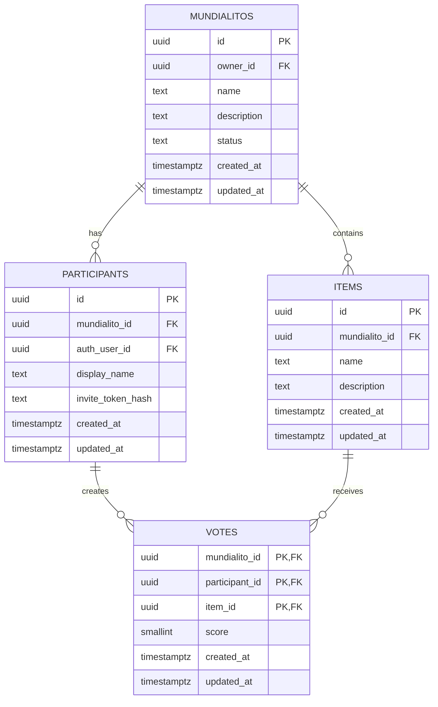

# Mundialito — Data Model & ERD

> Especificación compacta para agentes de IA durante el desarrollo.

## 1. Contexto

Mundialito es una aplicación mobile-first para crear pequeñas competiciones entre grupos de amigos. Un Mundialito contiene participantes e ítems evaluables; cada participante puede puntuar cada ítem de 1 a 10.

Stack: **Next.js + React + TypeScript + Supabase + PostgreSQL + Supabase Auth + RLS**.

Prioridades: simplicidad, normalización razonable, seguridad básica correcta, mantenibilidad y posibilidad de evolución sin sobrearquitectura.

---

## 2. Modelo MVP

Usar **4 tablas de negocio**:

```text
auth.users
    │
    ├── mundialitos.owner_id
    │
    └── participants.auth_user_id

mundialitos
    ├── participants
    ├── items
    └── votes
            ├── participant
            └── item
```

### `mundialitos`

Representa la competición.

| Columna | Tipo | Reglas |
|---|---|---|
| `id` | uuid | PK, default `gen_random_uuid()` |
| `owner_id` | uuid | NOT NULL, FK → `auth.users.id` |
| `name` | text | NOT NULL, no vacío |
| `description` | text | nullable |
| `status` | text | NOT NULL, default `DRAFT`, CHECK `DRAFT/ACTIVE/FINISHED` |
| `created_at` | timestamptz | NOT NULL, default `now()` |
| `updated_at` | timestamptz | NOT NULL, default `now()` |

Estados válidos y transición conceptual:

```text
DRAFT → ACTIVE → FINISHED
```

No permitir volver a estados anteriores.

### `participants`

Representa la **participación de una persona en un Mundialito**, no una persona global.

| Columna | Tipo | Reglas |
|---|---|---|
| `id` | uuid | PK, default `gen_random_uuid()` |
| `mundialito_id` | uuid | NOT NULL, FK → `mundialitos.id` |
| `auth_user_id` | uuid | nullable, FK → `auth.users.id` |
| `display_name` | text | NOT NULL, no vacío |
| `invite_token_hash` | text | nullable, UNIQUE si se usa invitación sin cuenta |
| `created_at` | timestamptz | NOT NULL, default `now()` |
| `updated_at` | timestamptz | NOT NULL, default `now()` |

Restricciones:

```text
UNIQUE (mundialito_id, id)
UNIQUE (mundialito_id, auth_user_id)
UNIQUE (invite_token_hash)
```

`auth_user_id` puede ser NULL para permitir participantes aún no vinculados a una identidad.

### `items`

Los ítems son **locales a cada Mundialito**. No crear catálogo global en el MVP.

| Columna | Tipo | Reglas |
|---|---|---|
| `id` | uuid | PK, default `gen_random_uuid()` |
| `mundialito_id` | uuid | NOT NULL, FK → `mundialitos.id` |
| `name` | text | NOT NULL, no vacío |
| `description` | text | nullable |
| `created_at` | timestamptz | NOT NULL, default `now()` |
| `updated_at` | timestamptz | NOT NULL, default `now()` |

Restricción:

```text
UNIQUE (mundialito_id, id)
```

No imponer `UNIQUE(mundialito_id, name)` salvo que sea una regla de negocio explícita.

### `votes`

Representa:

```text
participant → item → score
```

| Columna | Tipo | Reglas |
|---|---|---|
| `mundialito_id` | uuid | NOT NULL, PK compuesta |
| `participant_id` | uuid | NOT NULL, PK compuesta |
| `item_id` | uuid | NOT NULL, PK compuesta |
| `score` | smallint | NOT NULL, CHECK `1 <= score <= 10` |
| `created_at` | timestamptz | NOT NULL, default `now()` |
| `updated_at` | timestamptz | NOT NULL, default `now()` |

PK:

```sql
PRIMARY KEY (mundialito_id, participant_id, item_id)
```

FK críticas:

```text
(mundialito_id, participant_id)
    → participants(mundialito_id, id)

(mundialito_id, item_id)
    → items(mundialito_id, id)
```

**No eliminar `mundialito_id` de `votes`**: permite que PostgreSQL impida votos cruzados entre Mundialitos mediante FK compuestas, sin depender de triggers.

---

## 3. ERD



---

## 4. Reglas de negocio e integridad

### Estructura

- Un Mundialito tiene muchos participantes.
- Un Mundialito tiene muchos ítems.
- Un participante pertenece a un único Mundialito.
- Un ítem pertenece a un único Mundialito.
- Un voto pertenece simultáneamente al mismo Mundialito, participante e ítem.
- Un participante no puede votar dos veces el mismo ítem.
- `score` siempre debe estar entre 1 y 10.

### Estados

**DRAFT**
- administrar participantes e ítems.
- editar configuración.
- no votar.

**ACTIVE**
- votar.
- modificar votos propios.
- no modificar libremente estructura.

**FINISHED**
- solo lectura para la competición.
- no crear/modificar votos.
- no modificar estructura.

Las reglas de estructura/integridad deben estar en constraints/FK/CHECK; las reglas de autorización y estado deben reforzarse con RLS. La UI nunca debe ser la única barrera.

### Delete behavior

Recomendado:

```text
auth.users → mundialitos.owner_id      ON DELETE CASCADE
auth.users → participants.auth_user_id ON DELETE SET NULL
mundialitos → participants              ON DELETE CASCADE
mundialitos → items                     ON DELETE CASCADE
participants/items → votes              ON DELETE CASCADE
```

Objetivo: eliminar Mundialitos sin dejar votos, participantes o ítems huérfanos.

---

## 5. Resultados

**No almacenar resultados derivados en el MVP.**

No persistir:

```text
average_score
ranking
vote_count
min_score
max_score
```

Calcularlos mediante queries/views sobre `votes`.

Esto mantiene una única fuente de verdad y evita inconsistencias.

Una materialización de resultados solo tiene sentido si el volumen de votos o las consultas futuras lo justifican. Al ser `FINISHED` inmutable, una materialización posterior sería relativamente sencilla.

---

## 6. Índices MVP

Las PK/UNIQUE ya generan índices; no duplicarlos.

| Índice | Tabla | Columnas | Motivo |
|---|---|---|---|
| `mundialitos_owner_id_idx` | `mundialitos` | `owner_id` | listar Mundialitos del owner y ayudar a RLS |
| `participants_auth_user_id_idx` | `participants` | `auth_user_id, mundialito_id` | resolver memberships del usuario y RLS |
| `participants_invite_token_hash_key` | `participants` | `invite_token_hash` | lookup rápido de invitación |
| `votes_item_idx` | `votes` | `mundialito_id, item_id` | votos por ítem / resultados |

La PK de `votes` ya sirve para consultas por:

```text
mundialito_id + participant_id
```

No agregar índices adicionales sin una consulta real que lo justifique.

---

## 7. RLS / seguridad

### Owner

Puede:

- crear sus propios Mundialitos (`owner_id = auth.uid()`).
- leer sus Mundialitos.
- modificar configuración en `DRAFT`.
- administrar participantes en `DRAFT`.
- administrar ítems en `DRAFT`.
- iniciar/finalizar el Mundialito.
- consultar todos los votos/resultados de sus Mundialitos.

No debe poder modificar votos ajenos salvo que se defina explícitamente esa capacidad en el futuro.

### Participant

Identidad normal:

```text
auth.uid() = participants.auth_user_id
```

Puede:

- leer el Mundialito al que pertenece.
- leer los ítems necesarios para votar.
- crear sus propios votos solo en `ACTIVE`.
- actualizar sus propios votos solo en `ACTIVE`.

Nunca puede modificar el voto de otro participante.

### FINISHED

RLS debe bloquear:

```text
INSERT votes
UPDATE votes
DELETE votes
```

y bloquear modificaciones estructurales.

### Participantes sin cuenta

Si se desea invitación/claim sin cuenta, usar `invite_token_hash` y una operación segura para vincular el participante a `auth.uid()`.

No exponer un mecanismo que permita al cliente reclamar arbitrariamente un participante solo con un `participant_id`.

### Principio clave

```text
Frontend = UX
RLS/DB   = seguridad real
```

Nunca asumir que ocultar botones o validar estado en React protege los datos.

Evitar políticas RLS recursivas. Si hace falta, usar pequeñas funciones de autorización `SECURITY DEFINER` bien restringidas para resolver owner/membership.

No usar `service_role` en el cliente.

---

## 8. Decisiones arquitectónicas que no deben cambiarse sin motivo

### 1. No crear `public.users` en MVP

Supabase Auth ya gestiona la identidad. Crear una tabla `users` propia solo agrega complejidad sin aportar valor todavía.

Cuando aparezcan perfiles (`display_name`, avatar, preferencias, etc.), crear `profiles` referenciando `auth.users.id`.

### 2. `participants` es membership contextual

No representa una persona global. El mismo usuario puede tener múltiples registros en `participants`, uno por Mundialito.

### 3. Ítems locales al Mundialito

No crear catálogo global, `products`, `brands`, categorías ni tablas de asociación en MVP.

### 4. `votes` tiene PK compuesta

No crear `vote_id` artificial salvo que aparezca una necesidad real de referenciar votos individualmente desde otras entidades.

### 5. `votes.mundialito_id` es intencional

Existe para reforzar la pertenencia mediante FK compuestas y evitar votos cruzados sin triggers complejos.

### 6. Resultados son derivados

La fuente de verdad son los votos.

### 7. No sobrearquitecturar

No agregar todavía:

```text
profiles
friends
friendships
products/catalog
rounds
criteria
weights
comments
notifications
audit_logs
soft_delete
materialized_results
co-organizers
```

Solo agregarlos cuando exista un requisito real.

---

## 9. MVP vs futuro

### MVP

- `mundialitos`
- `participants`
- `items`
- `votes`
- Supabase Auth
- RLS
- estados `DRAFT/ACTIVE/FINISHED`
- puntuación `1..10`
- URLs/invitaciones
- resultados calculados desde votos

### Futuro

Posibles extensiones:

- `profiles`
- historial de Mundialitos por usuario
- amigos / friendships
- co-organizadores / roles
- catálogo global de productos
- auditoría
- notificaciones
- resultados materializados
- criterios/puntuaciones avanzadas

No implementar estas extensiones en el MVP salvo que aparezca un requisito concreto.

---

## 10. Checklist para agentes de IA

Antes de modificar el modelo, comprobar:

- [ ] ¿Se mantiene `Mundialito → participants/items → votes`?
- [ ] ¿Se preserva `PRIMARY KEY (mundialito_id, participant_id, item_id)` en votes?
- [ ] ¿Se preservan las FK compuestas de votes?
- [ ] ¿`score` sigue limitado a 1..10 en DB?
- [ ] ¿No se introducen votos cruzados entre Mundialitos?
- [ ] ¿RLS sigue bloqueando votos fuera de `ACTIVE`?
- [ ] ¿Un participante solo puede modificar sus propios votos?
- [ ] ¿La estructura queda bloqueada en `ACTIVE/FINISHED`?
- [ ] ¿Los resultados siguen siendo derivados?
- [ ] ¿Se evita agregar tablas solo “por si acaso”?
- [ ] ¿Se preservan los `ON DELETE` previstos?
- [ ] ¿Se agregan índices solo para consultas reales?

Cualquier cambio que altere estas invariantes debería tratarse como **decisión arquitectónica** y documentarse como ADR cuando corresponda.
